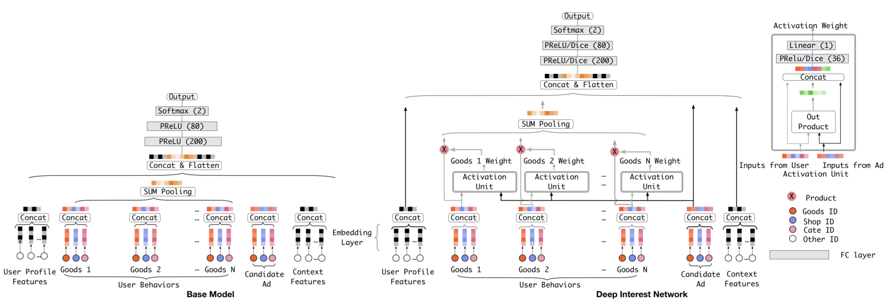
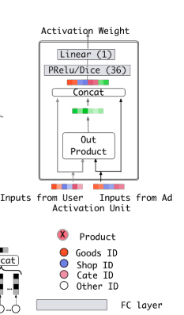
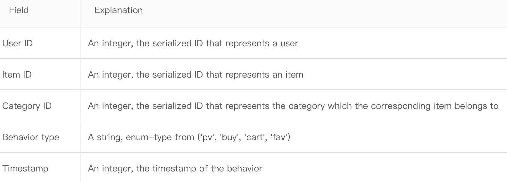
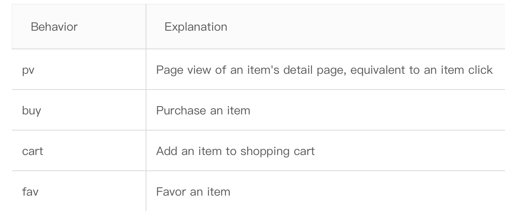
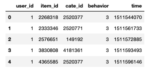

# 【序列建模】DIN深度兴趣网络
通过用户的历史行为序列刻画用户兴趣的广泛性，是推荐系统比较大的一个难点，用户历史行为序列建模的研究经历了从Pooling、马尔可夫链、RNN到attention、capsule再到transformer的顺序；

- Pooling：代表是Youtube DNN ，对用户历史行为的商品ID进行embedding后再sum pooling/mean pooling，比如用户历史买过10件电子产品和1件衣服，那embedding被pooling仍然能够反映出用户对电子商品的偏好。这种做法优势是比较容易实现，复杂度也不高，但是很多信息会被平滑了，在长序列建模中，这种就尤其容易学到四不像的一个embedding。
- Concat：就是把历史行为序列的embedding直接拼接在一起输入网络，但是在推荐场景下，本身特征维度已经很高了，这种做法1是容易过拟合2历史行为本身已经很长了拼接后参数膨胀，对学习和线上推理都是一个负担。
- RNN模式：DIEN就是用的这种方法，把历史行为输入一个序列网络学习来抽取信息，他的缺点是，RNN顺序学习的方法不利于线上并行，导致速度上不去；另一个原因是在推荐场景中，可能用户的兴趣是跳跃的，比如先买了键盘后，买了一件衣服，才回来买鼠标，RNN顺序学习的模式也难以学习到这种跳跃信息。此外最近也有一些研究任务RNN范式对推荐场景是不适用的。
- Attention：代表是SASRec，也是DIN模型用的方法，attention可以学习到序列信息中每一个具体item的权重，这样进行pooling的时候能够对本次行为相关的商品赋予更大的权重，它的缺点是attention本身没有利用时间信息，也就是如何利用用户购买的顺序信息，如何设计位置编码也有很多论文进行了探讨。
- 胶囊网络：MIND用的方法，利用胶囊网络中动态路由算法来表达用户多种行为兴趣。通常是在召回阶段用户序列模型得到的兴趣向量，召回的商品都很相似，无法刻画用户兴趣的多样性。Capsule建模能够得到多个用户的兴趣向量，从而召回用户的多类目商品。
————————————————
## Motivation
在DIN之前，业界处理序列特征，普遍是在embedding之后进行pooling，这种做法将序列特征的每个item看作是相等的权重，举个例子：用户历史购买过9件衣服和1个鼠标，本次候选商品是键盘，但是因为用户历史行为被衣服充斥着，历史行为pooling后的embedding非常偏向衣服这个子空间，而历史购买键盘后再买鼠标显然应该赋予更大的权重。通过pooling的做法就会导致历史行为的兴趣被平滑了，学成一个四不像的没法体现用户广泛兴趣的向量。



DIN模型提出的动机是利用target attention的方法，进行加权pooling，它为历史行为的物品和当前推荐物品计算一个attention score，然后加权pooling，这样的方法更能体现用户兴趣多样性。在工业界实践中，DIN模型也证明了他的优异性能，即使到了当前（2022）我了解腾讯很多组在规模不大的推荐场景下还是会使用DIN模型。
## Attention Layers

DIN主要是利用一个局部激活单元来计算attention得分，它的attenton是一个MLP，输入是历史行为的item和当前候选商品的item，输出它们的相关性得分，同时还加入了两者的差以及外积，一起输入，体现一个特征交叉。

原文还特别提到了DIN的权重计算出来后不用通过softmax（不同于transformer的self-attention）来体现用户的多峰兴趣。我理解的这个做法主要是因为softmax会加强最大值哪个数的强度，削弱其他强度，如果有个item计算出来的score和别人不是一个数量级，那其他item将会被softmax后趋近于0，不利于表达用户列表中多个和候选商品有关的历史行为。

## DIN模型的不足

1. DIN这种pooling的方式在序列长度不长的时候其实还是可以驾驭的，但是一旦序列长度过长就还是会丢失很多信息，无法充分学习到多峰的注意力，所以更长的序列特征需要更好的特征抽取器，这也是DIN以后的论文的一个研究方向；

## DIN模型复现

### 数据集
复现DIN的时候采用了是阿里巴巴提供的一个淘宝用户行为数据集，用于隐式反馈推荐问题的研究。数据集链接：https://tianchi.aliyun.com/dataset/dataDetail?dataId=649。

这是数据集比较简单，只有一个文件，特征也不多，易于我们跑一个baseline。


### 特征工程

特征中主要关注的是行为列，这一个列有四种离散类型，在复现DIN的时候，我们可以把这四种类型都当作正样本，也就是整个数据集都是正样本。所以这个特征我们用类别编码，方便后续处理。

```
from sklearn.preprocessing import LabelEncoder
le = LabelEncoder()
data_raw.behavior = le.fit_transform(data_raw.behavior)
```
此时数据集的样子：


#### 如何构建样本
DIN构建样本的方式比较多，首先是负样本的选择：因为我们的数据集只有正样本，所以采用全局随机选择一条没有出现在用户行为列表的样本作为负样本。产生样本的方法是根据用户行为列表，把前n-1条当作行为列表，第n条当作候选item，也就是本次需要预测的商品。然后把这条item换成随机生成的item，就是一条负样本了。

我测试过两种构建样本的方式，第一种是每个user只生成正负样本各一条，也就是选用用户最后一条购买的item作为预测，然后1:1生成负样本，发现这种情况下训练集auc达到了1，存在特征泄漏，但是一直也没找到原因。第二种是采用滑动窗口，用户历史行为每一条item都为他生成正负样本各一条。
## Attention Unit
整个模型的复现我是基于tensorflow2的，参考了deepctr和潜心开源的版本。DIN中的attention机制就是一个mlp，这里复现的版本是加了softmax的，具体实现可以看代码：

```
    def call(self, inputs):
        querry, key, val, mask = inputs
        # 为每一个行为序列的item计算score，方法是先把候选商品展开为和序列一样的维度，也就是maxlen的长度
        querry = tf.tile(querry, multiples=[1, key.shape[1]])
        querry = tf.reshape(querry, shape=[-1, key.shape[1], key.shape[2]])
        # 特征交叉
        outputs = tf.concat([querry, key, querry-key, querry*key], axis=-1)
        # dnn
        for dense in self.dense:
            outputs = dense(outputs)
        # 对于我们padding为0的那些元素，不用参与score计算，所以给他们赋予很小的权重
        outputs = self.out(outputs)
        outputs = tf.squeeze(outputs, axis=-1)
        padding = tf.ones_like(outputs) *(-2 ** 32 + 1)
        outputs = tf.where(tf.equal(mask, 0), padding, outputs)
        # softmax层
        outputs = tf.nn.softmax(logits=outputs)
        outputs = tf.expand_dims(outputs,axis=1)
        # 加权pooling
        outputs = tf.matmul(outputs, val)
        outputs = tf.squeeze(outputs, axis=1)

        return outputs
```
基本上挤上了注释，能够看懂每一部分在干啥就能看懂。
### DIN
有了attention模块，我们实现din就容易很多了，我也基本加了注释，完整的代码可以看github：[DIN复现github](https://github.com/wangych6/Deep_Learning_Recommender_System_Algorithm)，只需要把数据集放入datasets目录就可以直接跑：

```
class DIN(Model):
    def __init__(self,
                 feature_columns,
                 behavior_feature_list,
                 attention_hidden_units=None,
                 dnn_hidden_units=None,
                 attention_activation='prelu',
                 dnn_activation='relu',
                 dnn_dropout=0,
                 embedding_regularizer=1e-4,
                 sequence_length=50,
                 **kwargs):
        super(DIN, self).__init__()
        if dnn_hidden_units is None:
            dnn_hidden_units = (512, 128, 64)
        if attention_hidden_units is None:
            attention_hidden_units = (64, 32)
        self.sequences_length = sequence_length
        self.dense_feature_info, self.sparse_feature_info = feature_columns

        self.other_sparse_lenght = len(self.sparse_feature_info) - len(behavior_feature_list)
        self.dense_feature_length = len(self.dense_feature_info)
        self.behavior_feature_nums = len(behavior_feature_list)

        self.sparse_features_embedding = [Embedding(input_dim=feat['feat_num'],
                                                    input_length=1,
                                                    output_dim=feat['embed_dim'],
                                                    embeddings_initializer='random_uniform',
                                                    embeddings_regularizer=l2(embedding_regularizer))
                                          for feat in self.sparse_feature_info
                                          if feat['feat'] not in behavior_feature_list]

        self.sequences_features_embedding = [Embedding(input_dim=feat['feat_num'],
                                                       input_length=1,
                                                       output_dim=feat['embed_dim'],
                                                       embeddings_initializer='random_uniform',
                                                       embeddings_regularizer=l2(embedding_regularizer))
                                             for feat in self.sparse_feature_info
                                             if feat['feat'] in behavior_feature_list]

        self.attention_layer = AttentionLayer(attention_hidden_units, activation='prelu')
        self.batchnorm = BatchNormalization(trainable=True)
        self.dnn_layer = [Dense(unit, activation=PReLU()) for unit in dnn_hidden_units]
        self.dropout = Dropout(dnn_dropout)
        self.out = Dense(1)

    def call(self, inputs):
        dense_inputs, sparse_inputs, sequense_inputs, item_inputs = inputs
        mask = tf.cast(tf.not_equal(sequense_inputs[:, :, 0], 0), dtype=tf.float32)
        # 非序列的稀疏特征通过embedding后，和稠密特征拼接
        other_inputs = dense_inputs
        for i in range(self.other_sparse_lenght):
            other_inputs = tf.concat([other_inputs, self.sparse_features_embedding[i](sparse_inputs[:, i])], axis=-1)

        # 序列特征enbedding
        sequense_embedding = tf.concat([self.sequences_features_embedding[i](sequense_inputs[:, :, i]) for i in range(self.behavior_feature_nums)], axis=-1)
        item_embedding = tf.concat([self.sequences_features_embedding[i](item_inputs[:, i]) for i in range(self.behavior_feature_nums)], axis=-1)

        # 把序列特征输入attention层
        user_info = self.attention_layer([item_embedding, sequense_embedding, sequense_embedding, mask])
        if self.dense_feature_length > 0 or self.other_sparse_lenght > 0:
            outputs = tf.concat([user_info, item_embedding, other_inputs], axis=-1)
        else:
            outputs = tf.concat([user_info, item_embedding], axis=-1)

        # 送入dnn
        for dense in self.dnn_layer:
            outputs = dense(outputs)

        outputs = self.dropout(outputs)
        outputs = tf.nn.sigmoid(self.out(outputs))

        return outputs
```
#### 参考
- [DeepInterestNetwork](https://github.com/zhougr1993/DeepInterestNetwork)
- [Recommender System with TF2.0---v0.0.3](https://github.com/ZiyaoGeng/Recommender-System-with-TF2.0/tree/master)

