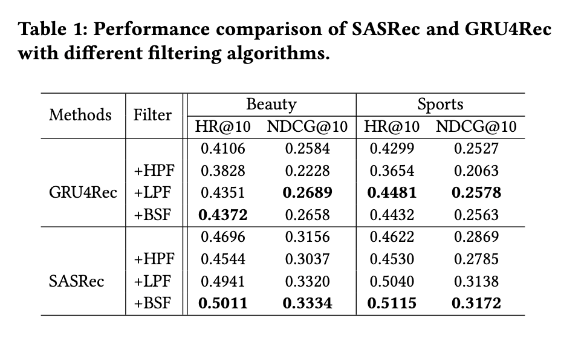
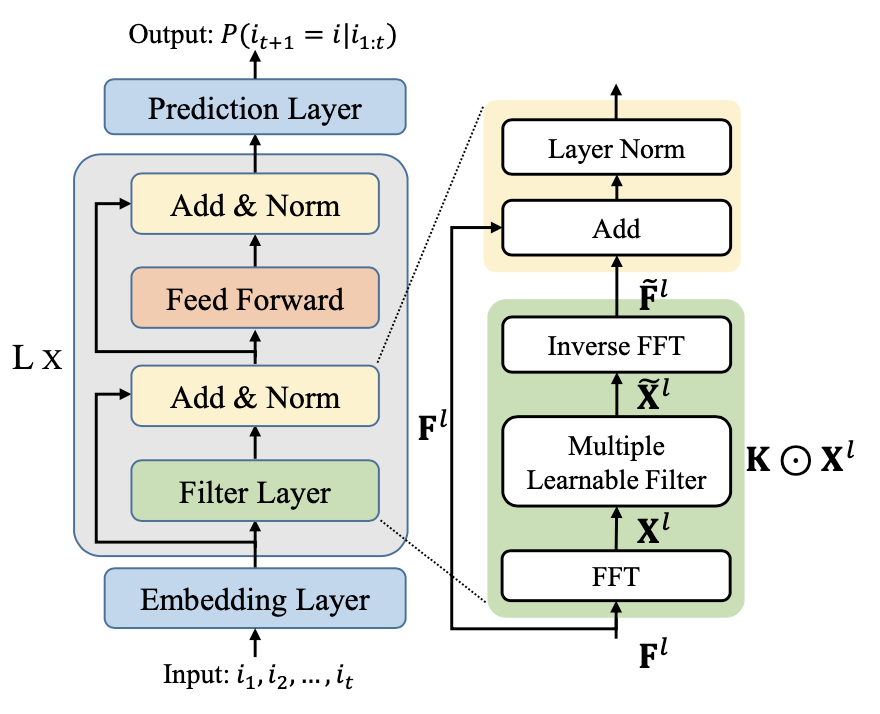

# 【序列建模】FMLP：Filter-enhanced MLP is All You Need for Sequential Recommendation---滤波增强的序列推荐

这是一篇在最新WWW'2022发表的引入了带学习参数滤波器的序列推荐模型，用于召回任务，和它最像的模型就是SASRec了。

主要创新点是把Transformer中的attention层换成了一个滤波层，这种做法是数字信号处理中的一种算法，在深度学习领域最早是在CV的模型中首次引入的，所以这篇文章的模型和图片分类模型GFNet这篇文章也特别相似。作者把这种滤波器做法引入了推荐序列中，取得了很好的效果。本文引入的主要的两个创新点：

1. 降低Attention的复杂度：复杂度在召回任务中非常看重的指标，在序列推荐中，我们之前经常用的就是采用Attention机制来捕捉用户的兴趣变化，但是Attention的堆叠不可避免带来了模型非常大的参数量。

2. 过滤序列中的噪声：作者假设没有噪声的序列会让网络更加容易的学习，为了证明这个假设，作者后面也做了实验。我们的序列不可避免的会带有噪声，甚至是怀有恶意的点击信息，以往的做法CNN、RNN、GNN受到噪声影响不免会过拟合，在Attention机制的模型中，噪声带来的影响会更加的大。所以FMLP引入了信号处理领域的滤波器在频率域过滤这些噪声。

## 总结

1. 用户行为序列包括了很多噪声，通过**数字信号处理里的过滤算法有助于减少噪声**。同样在科研中，我们可以注意其他领域有什么可以迁移到本领域的知识做法，没准又是一篇顶会；
2. 可学习滤波器相当于时域中的循环卷积，**拥有和attention一样感受野**，可以更好地捕捉周期性特征，而且具有更加好的时间复杂度，**大大减少了参数量**；
3. 循环卷积能够捕捉到更多的周期性特征；

## 模型分析

###  傅立叶变换

1-D离散傅立叶变换（DFT）是这篇文章的核心，变换公式是这样的：
$$
X_k = \sum_{n=0}^{N-1}x_ne^{-\frac{2\pi i}{N}nk}
$$
这里i是虚数，傅立叶变换会从时间域点对点的转换图片的像素到频率域。同时DFT的复杂度是能通过快速傅立叶变换转换为NlogN的复杂度的，远比Attention复杂度低（n^2*d, 复杂度来源是attenton公式Q * K^T， 两个[n, d]维度矩阵乘法的复杂度）。

文章在最后也有个理论分析证明了频率域的乘法等价于时域的卷积，FFT等价于循环卷积，

### 滤波器性能分析

作者做了实验分析傅立叶变换加入后对模型性能的影响，这里base模型采用了GRU4Rec和SASRec，滤波器采用了高通滤波器、低通滤波器、带阻滤波器。可以看到和base模型模型比，加入滤波器都会有一定的提升，在GRU4Rec中，LPF提升比较多，在SASRec中带阻滤波器直接高了5个点。这里可以得出的结论有：

1. item emebdding确实有噪声影响模型的性能；
2. 合适的滤波器确实有用，但是不同的模型对滤波器参数的需求是不一样的；
3. 在自然界和人类行为学中，低频信息是更加重要的信息，这项结果在水文学、地震学也是如此；

## 模型结构

模型结构是比较简单的，base模型虽然叫mlp，但是用transformer理解会更容易一些，就是把transformer的self-attention换成了FFT，FFT在torch和tf中都已经包装有对应的函数了。下面分析下各层：

### Embedding层

加入了LayerNorm和Dropout还有Position Embedding，和SASRec方案一样，总体的公式就变成了：
$$
E_i = Dropout(LayerNorm(E+P))
$$

### Learnable Filter-enhanced Blocks

和Self-Attention层一样，可学习滤波层同样会堆叠多个block，每一个滤波层包括一个FFT模块和一个feed-forward网络。这里同样也采用可skip connection、dropout和LN，这些都差不多。但是需要注意加入新的层是否可以被优化器学习，在FMLP中可以证明滤波器的可学习参数同样能被SGD优化。

### Prediction Layer

这一层的计算公式是这样的：
$$
P(i_{t+1}=i|i_{i:t}) = e^T_i F^L_t
$$
这里e是用户i从embedding矩阵学习出来的。F是L层Learnable Filter-enhanced Blocks。同样每个样本会生成一条负样本，最后loss是正负样本的log距离。

### 参考

[FMLP](https://arxiv.org/pdf/2202.13556.pdf)