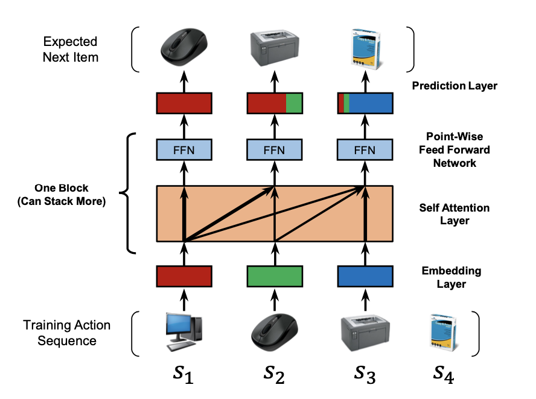
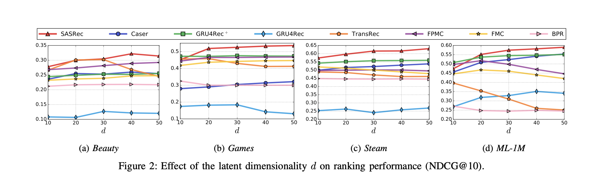
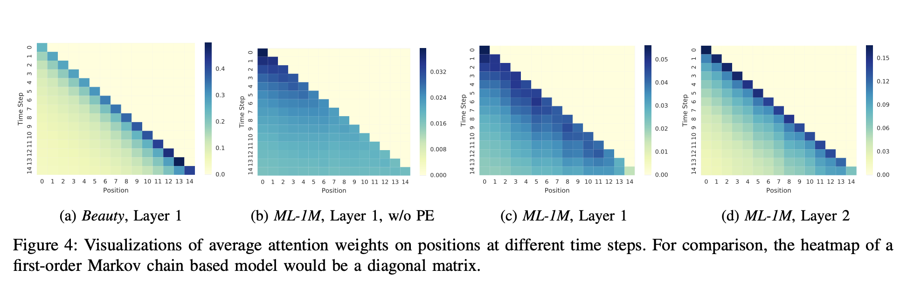

# 【序列建模】SASRec---自注意力序列推荐

SASRec是比较早期对序列特征建模的一篇论文，也是很早利用self-attention机制作用于序列特征抽取的一个召回模型。整个模型和transformer基本一致，效果也不错，因为提出的早（在这之前只有AFM这些），所以大概就是推荐领域的ViT模型，对attention大规模应用在序列推荐领域有非常重要的推动。

序列特征是推荐模型最关键的特征之一，很多推荐模型都是在尝试不同特征抽取器对序列特征的效果。在SASRec提出的时期（18年），对序列特征建模主要方法是马尔可夫链MC和RNN。MC更适用于捕捉最近的一些序列，对稀疏数据也更加友好；而RNN擅长捕捉长期序列，但是RNN的模型复杂度需要稠密数据才能负担得起。SASRec的提出就是为了平衡两者----既能处理长数据又可以从长序列中提取出关键信息，同时SASRec另一个特点是能够比上述模型复杂度更低——这是依赖于attention可以并行计算加速的机制，这在召回中是非常重要的。

整套模型的架构如下：

# Method

## Sequential Embedding

对于用户行为序列，一般选择和大部分用户长度差不多的作为最大长度 n，如果太长，按照时间选择近的n条；如果太短，就padding item到n条，而且在左侧padding。

创建一个item embedding矩阵M，维度是I*d，d是隐向量维度。这样和输入的序列相乘会得到一个n * d的矩阵，其中被padding的位置是0。

### Positional Embedding

不同于DIN，SASRec是加入了PE的，PE在推荐场景中是否有效果其实还是挺有争议的，因为ctr任务没有明显先后关系，比如先买鼠标才会买键盘（但是也可以考虑一般人都是先买电脑才会买鼠标，这又说明有时序关系），所以是否有用作者也做了消融实验，这个在后面分析。

## Self-Attention

SASRec用的是标准attention，但是有一个比较不同的是Causali放在下面说。这一层对embedding后的输出经过q、k、v三个矩阵变换，三个矩阵仿射变换能够让模型表达性更加好，比如我的k * 你的q和你的k * 我的q不是一个意思。

## Causality

为了防止特征穿越，所以在Q*K的时候禁止Q查询比自己后面的K，表示的意思就是禁止和自己历史行为之后的信息进行交互。

## Stacking Self-Attention

也就是堆叠了多个attention层，作者认为可以学习到更多的item之间的交叉信息。但是随着网络层数加深，也带来了一些问题：

1. 过拟合越来越严重了；
2. 训练变得不稳定，主要是因为梯度消失的影响；
3. 模型复杂度加深了，训练的时间也变得更长了；

针对这些问题，作者引入了Dropout和LayerNorm模块，以及残差链接。这些也是transformer普遍做法。

## Prediction Layer

在经过attention提出用户行为序列的信息后，为了预测下一个感兴趣的item，作者使用了MF层：
$$
r_{i, t} = F^b_t M^T_i
$$
F理解起来就是使用一个函数从item embedding抽取出来的信息。M是item embedding，MF层是使用item embedding矩阵乘以网络提出出来的信息得到的。得分越高的embedding代表越有可能的下一个item，这就可以用于推荐任务了。

这里作者使用了共享item embedding，虽然使用同质的embedding不能够学习到不对称信息（比如人们倾向于买了a后去买b，而不是相反），原因是两个向量内积使用交换律不改变结果。不同于这样的一些模型（比如FPMC）SASRec支持共享embedding，这是因为SASRec神经网络是经过了非线性变换层的，所以交换律不生效。

### User Embedding

这一层还有一个实验是是否为模型学习一个显式的user embdding，现存的方法有两类：

1. Explicit user embedding：模型学习到实际的embedding代表用户的行为，比如MF；
2. Implicit user embedding：只考虑用户行为序列。SASRec就属于这种。作者也做过实验是否学习一个user emebdding，但是作用提升不大。

## Out

最后计算方法是使用隐式的用户embedding和正负样本分别相乘，loss让学习到的embedding尽量靠近正样本，远离负样本。

## 最终结果

这是最终性能：

作者做了消融实验证明模型的作用：

1. 移除Position embedding：在稀疏数据上，移除pe效果会更好，而在稠密数据上，移除pe效果变差；

2. 不使用共享item embedding：效果变差，作者分析是因为过拟合了；

3. 移除residual bonnection：显著变差，尤其是在稀疏数据上，作者分析因为前面层次信息流入后面层次收到了影响；

4. 移除drop out：效果显著变差；

5. blocks的数目：作者做了0、1、3三层的block，性能依次变好，尤其是在稠密数据上；

6. 加入multi-head：性能变差，作则分析是因为我们的embedding维度比较小，而transformer是512，多头不适用于小的子空间；

   

作者还做了对attention权重热图进行分析：

1. a vs c：这两个数据集一个是稀疏（beauty）一个是稠密（ml）数据集，从他们的attention权重可以看出稀疏数据更多关注最近的信息，而稠密数据对远处也更关注一些。这是SASRec能够驾驭不同数据的原因；
2. b vs c：加不加position embedding的区别，可以看出加了PE后会更关注最近的信息，不加的话会更加均匀的关注所有item；
3. c vs d：可以看出更高层的attention更加关注最近的消息；

## 总结

1. Causality：在序列推荐中引入self-attention需要考虑是否会出现特征泄漏，比如用过去的item 去query未来item，会导致本item学习到未来的信息，导致过拟合；
2. 没有候选item：不同于DIN是排序模型，SASRec不使用候选item，只是为每一个item根据行为序列学习一个embedding；
3. attention的效果：稀疏数据更多关注最近信息，稠密关注更均匀。加入pe更多最近的信息。高层的attention更多关注最近信息；
4. 消融实验：作者的实验分析是比较精彩的，而且里面的一些结果和原因分析是值得我们后续建模时参考的。