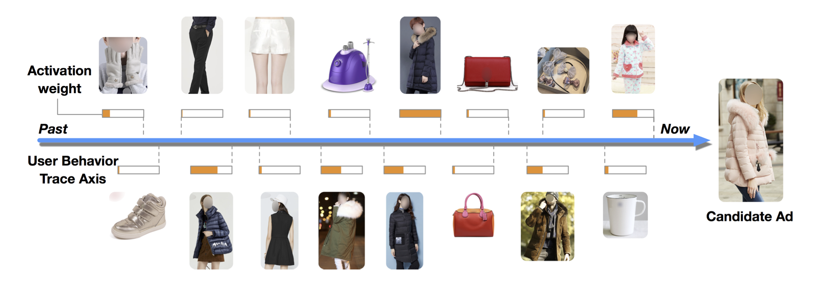

# 【序列建模】推荐广告中的序列建模

最近在腾讯的实习中做的是行为序列推荐相关的工作，所以开个专题对行为序列推荐做一个汇总整理。一般推荐系统做特征工程，特征会有如下几种：

- 用户侧特征：比如用户id、性别、地理位置、年龄等比较普遍的信息，还有一些是结合你业务的特征，我做的游戏推荐，就会有用户游戏等级、游戏登陆时长、喜欢的游戏模式等特征。
- Item侧特征：比如item-id，item类型（视频？图文？具体结合业务）、item历史ctr、item的标签。除了这些比较普遍的特征以外，很多组也有有专门的内容理解团队，给item打上基于内容理解的tag或者embedding，短视频推荐中比较普遍的是对短视频标题的NLP理解和封面图中CV侧的理解。
- 场景特征：比如用户的点击发生在随便看看、搜索场景、广告推荐中，同一种行为可能代表了不同的含义。
- 用户历史行为序列信息：用户历史行为序列能够反映一定时间范围内用户的一个兴趣变化，比如用户昨天买了一台电脑，那我们能够预计他还会配上鼠标、键盘，我们就可以给他推荐这些商品。常见的用户行为序列包括了点击序列、点赞/收藏/下单序列等；

而在推荐广告中，历史行为序列是非常重要的特征。在序列建模中，主要任务目标是得到用户此刻的兴趣向量（user interest vector）。

## 用户历史行为序列建模主要工作

### 刻画用户兴趣的广泛性

如何刻画用户兴趣的广泛性，是推荐系统比较大的一个难点，用户历史行为序列建模的研究经历了从Pooling、RNN到attention、capsule再到transformer的顺序

- Pooling：代表是Youtube DNN ，对用户历史行为的商品ID进行embedding后再sum pooling/mean pooling，比如用户历史买过10件电子产品和1件衣服，那embedding被pooling仍然能够反映出用户对电子商品的偏好。这种做法优势是比较容易实现，复杂度也不高，但是很多信息会被平滑了，在长序列建模中，这种就尤其容易学到四不像的一个embedding。
- 直接拼接：就是把历史行为序列的embedding直接拼接在一起输入网络，但是在推荐场景下，本身特征维度已经很高了，这种做法1是容易过拟合2历史行为本身已经很长了拼接后参数膨胀，对学习和线上推理都是一个负担。
- RNN模式：DIEN就是用的这种方法，把历史行为输入一个序列网络学习来抽取信息，他的缺点是，RNN顺序学习的方法不利于线上并行，导致速度上不去；另一个原因是在推荐场景中，可能用户的兴趣是跳跃的，比如先买了键盘后，买了一件衣服，才回来买鼠标，RNN顺序学习的模式也难以学习到这种跳跃情况。
- Attention：DIN模型用的方法，attention可以学习到序列信息中每一个具体item的权重，这样进行pooling的时候能够对本次行为相关的商品赋予更大的权重，它的缺点是attention本身没有利用时间信息，也就是如何利用用户购买的顺序信息，如何设计位置编码也有很多论文进行了探讨。
- 胶囊网络：MIND用的方法，利用胶囊网络中动态路由算法来表达用户多种行为兴趣。通常是在召回阶段用户序列模型得到的兴趣向量，召回的商品都很相似，无法刻画用户兴趣的多样性。Capsule建模能够得到多个用户的兴趣向量，从而召回用户的多类目商品。

### 序列内容时间跨度

- Session序列：比如DSIN等网络，主要聚焦在关注用户当下的兴趣，通常只有几十分钟。
- 短期序列：比如DIN、DIEN等网络，关注的是用户的短期行为序列，通过就是用户过去几十条信息。短期序列是最能够反映用户当下主要兴趣的序列，是最能够利用的信息。
- 长期序列：比如SIM、MIMN关注用户的长期行为序列，可能是用户很长一段时间的序列，我了解到很多组会用用户过去一年的序列，反映了用户长期的兴趣，而且能从用户长期序列中挖掘出用户对品牌、价格、口味等信息的偏好。这里工作的主要难点是如何从长期兴趣中检索中与本次推荐相关的信息。

### 用户行为的属性

- item id：这是最细粒度的信息，也有一些场景下，商品ID可能无法反映用户的兴趣，比如电商场景下，用户兴趣广泛，长尾商品又多，网络无法充分学习到商品的embedding，同时对广泛兴趣的pooling容易学习到一个四不像的东西，这种场景可以考虑粗粒度的兴趣。
- 主标签、属性：比容item的类别、品牌的历史序列，这种能够避免itemid的长尾问题；
- 行为类型：是点击序列、收藏序列、购买序列反映的都是用户不一样的信息，我理解的短期序列更能反映用户的短期兴趣，而收藏购买更能体现用户的中长期兴趣。用户对点击过的序列大概率还是感兴趣的，而对购买过的序列可能短期内不会再考虑了。
- 行为的详细信息：比如本次点击停留时长、是否评论点赞分享等；

### 多种行为序列等组合

对于上面提到多种行为序列，可以有各种组合方法，比如近期的点击、收藏、购买序列如何在一起建模；

- 混合建模：按照时间顺序形成混合序列；
- 分别建模：对每一种序列分别建模，得到多个兴趣向量后输入网络；

序列建模是推荐系统中比较大的一个模块，这个专题后续将会针对上述研究工作的每一个具体方向研读下代表性的文章和主流的做法。

### 参考：

- [浅谈行为序列建模](https://zhuanlan.zhihu.com/p/420995638)

- [搜索推荐广告排序之用户行为序列建模](https://mp.weixin.qq.com/s/v2hZxQhXQjIrTFlrtN6w6w)

- [https://tech.meituan.com/2020/04/16/transformer-in-meituan.html](https://tech.meituan.com/2020/04/16/transformer-in-meituan.html)

- [谈谈推荐系统中的用户行为序列建模](https://zhuanlan.zhihu.com/p/138136777)

- [Transformer 在美团搜索排序中的实践](https://tech.meituan.com/2020/04/16/transformer-in-meituan.html)
